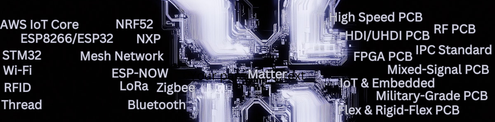

# 👋 Hello, I'm RabbitTigers

## 🚀 About Me
I am a passionate PCB designer with over 7 years of hands-on experience in designing and developing innovative solutions for the PCB Design world. My journey in the field has equipped me with a deep understanding of circuit design, pcb layout, hardware-software integration, real-time systems, and low-level programming.

## 💼 Professional Experience 
- **Senior PCB Designer** at Wolfspeed Corporation, Redmond, Washington, USA. (March 2022- present)
  - As an experienced PCB designer with over 7 years of industry experience, I am confident in my ability to deliver exceptional work that meets the requirements of the job and exceeds expectations.
  - I have a proven track record of delivering high-quality PCB designs that are robust, reliable, and manufacturable. Throughout my career, I have worked with an array of clients across a range of industries, including automotive, telecommunications, and consumer electronics. In each of my roles, I have consistently delivered work that has resulted in greater efficiency, improved performance, and higher customer satisfaction.
- **Electrical Engineering Intern** at First Co. Dallas, TX, United States (Sept 2020- March 2022)
  - Implemented various testing methodologies to ensure the reliability and accuracy of the driver, resulting in a 99% reduction in sensor communication errors.
  - Developed and optimized drivers for PIC18F25K50 GPIO, ADC, and Timers to enhance analog frontend signal processing, resulting in a 20% increase in signal accuracy.
  - Conducted test in accordance with ASHRAE Standard 193-2010 (RA 2014) to determine air leakage in packaged air conditioning unit.
  - Developed innovative design solutions for tubes and fixtures using AutoCAD Inventor, resulting in a 20% reduction in manufacturing costs.
 
- **Embedded Systems Engineer** at Accio Robotics Bangalore, India  (Dec 2018 – July 2020)
  - Led the development of CAN & Ethernet-based drivers for autonomous mobile robots, increasing data transfer rates and improving connectivity with external systems by 25%.
  - Created and maintained software documentation for both Python and C projects, ensuring compliance with industry standards and reducing error rates by 15%.
  - Developed low-level drivers for embedded communication protocols such CAN, UART/USART, SPI, I2C, I2S, Ethernet, and DCMI reducing code base size by 30%.
  - Managed version control for multiple projects simultaneously using Git, ensuring proper code collaboration across teams while maintaining strict adherence to release   schedules, resulting in an on-time delivery rate of over 95%.
 
- **Hardware Engineer** - Freelance Mumbai & Bangalore, India  (Aug 2016 – Dec 2018)
  -  Project: Robotic Arm Control System  
     *  Developed firmware for a robotic arm control system, implementing inverse kinematics algorithms and motion planning techniques.
     *  Collaborated with mechanical engineers to optimize the control system's dynamics, achieving precise and smooth robotic arm movements.
     *  Conducted extensive testing and calibration, ensuring accurate positioning and reliability in various operating conditions.  
     *  Received recognition for delivering the project within budget constraints and exceeding client expectations in terms of performance and
        usability.
     
  -  Project: Industrial IoT Gateway
     *  Created firmware for an industrial IoT gateway, enabling real-time monitoring and control of multiple sensors and actuators in a
        manufacturing environment.
     *  Collaborated with a cross-functional team to define and implement secure communication protocols, ensuring data privacy and integrity.
     *  Reduced data transmission latency by 40% through algorithm optimization, enhancing real-time monitoring capabilities.
     *  Provided on-site support during system deployment, resolving technical challenges and ensuring a smooth transition to production.

  -  Project: Wearable Fitness Tracker
      * Led the development of embedded software for a wearable fitness tracker, incorporating step counting, heart rate monitoring, and sleep
        tracking features.
      * Implemented power management techniques, extending the device's battery life by 50%, which received positive feedback from users.
      * Collaborated with industrial designers to optimize the user interface and enhance user experience based on user feedback.
      * Successfully delivered the project ahead of schedule, meeting all project milestones and receiving commendation from the client.

## 🛠️ Skills
- **Design:** Altium Designer, KiCad, Eagle, Xepedition, Cadence
- **Sumulation:** pSpice, Mix-Maxed Sim, Maltisim, Modelsim 
- **Programming Languages:** C, C++, Python, HTML, CSS, Rust, Embedded C/C++, Java, System Verilog, VHDL, MATLAB
- **Microcontrollers:** STMicroelectronics, NXP, TI, Microchip, Atmel
- **Communication Protocols:** I2C, SPI, UART/USART, CAN, Ethernet, I2S, TCP/IP, USB, SAI, SDIO, SWD, JTAG, BacNET
- **Peripherals:** DCMI, DMA, Clock, Timer, Real Time Clock, GPIO, Interrupts, ADC, DAC, Watchdog, FSMC, DC/D
- **RTOS:** FreeRTOS, ChibiOS, CMSIS RTOS
- **Embedded Software Development:** Bare-metal programming, Firmware development, Real-Time System development
 

## 🌱 Interests
Embedded systems, IoT, Robotics, Low-level programming, and Continuous learning.

### Languages
---

 

 

 

<!--- 

### Softwares

  
 
--->
